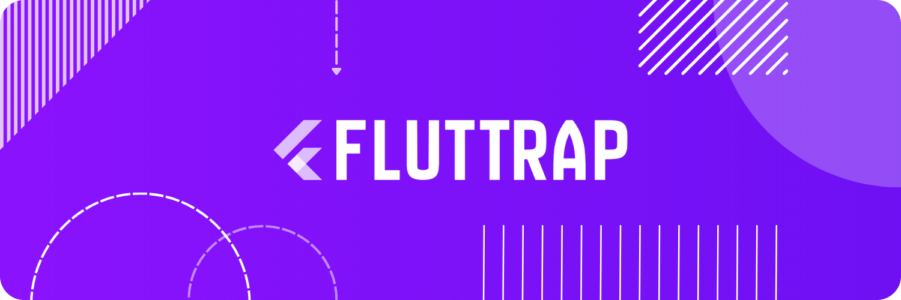

Fluttrap is a **Bootstrap-inspired UI framework for Flutter**, designed to help developers ship clean, scalable, and consistent user interfaces faster. It brings together reusable components, responsive layout utilities, and developer-friendly extensions into one lightweight, production-ready toolkit.

We’re launching soon - and Fluttrap is being built with one clear goal: **make Flutter UI development effortless, predictable, and enjoyable.**

## Why Fluttrap?

Flutter is powerful, but building production-grade UI often means:

- Rewriting the same layout patterns again and again
- Managing spacing, responsiveness, and theming manually
- Maintaining consistency across screens, teams, and platforms

Fluttrap solves this by giving Flutter developers a **framework-level UI layer** - similar to what Bootstrap did for the web.

You focus on **logic and experience**.  
Fluttrap handles **structure, consistency, and speed**.

## What’s Coming

Fluttrap will launch with a carefully curated set of tools designed for real-world Flutter apps:

- A responsive grid system for mobile, tablet, and web layouts
- Prebuilt UI components like buttons, cards, badges, modals, and lists
- Layout and spacing utilities to eliminate repetitive code
- A flexible theming system with light and dark support
- Developer extensions for faster UI composition
- Accessibility-friendly and performance-conscious defaults

Everything is designed to be **composable**, **extensible**, and **non-opinionated** - so it works with your architecture, not against it.

## Designed for Real Flutter Projects

Fluttrap is built for:

- Flutter mobile apps (Android & iOS)
- Flutter web applications
- Flutter desktop apps
- Startups, agencies, and large teams
- Developers who value speed, consistency, and clean code

Whether you’re prototyping fast or scaling a large product, Fluttrap adapts to your workflow.

## Philosophy

Fluttrap is not a replacement for Material or Cupertino.  
It’s a **productivity layer** on top of Flutter.

- Minimal magic
- Predictable APIs
- Sensible defaults
- Easy overrides

You should never fight your UI framework - Fluttrap is designed to get out of your way.

## Launch Status

🚧 **Currently in active development**  
📦 **Public launch coming soon**  
⭐ **Star this repository to stay updated**

Early documentation, examples, and packages will be published at launch.

## Roadmap (Initial)

- Core layout system and responsive utilities
- Essential UI components
- Theme engine and design tokens
- Example apps and usage patterns
- Documentation site

## Join the Launch

If you’re a Flutter developer who:

- Builds UI-heavy apps
- Cares about clean and scalable code
- Wants to ship faster without cutting corners

**Fluttrap is built for you.**

👉 Star the repo  
👉 Watch for updates  
👉 Be part of the launch
